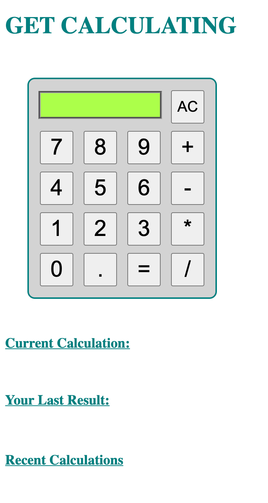
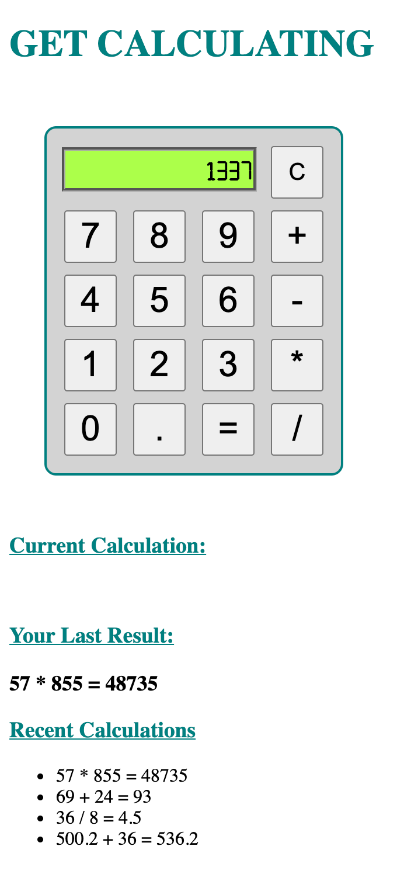

# Server Side Calculator
## Description

Our goal for this project was to develop a calculator that uses a server to store equations. The classic calculator interface makes it easy for the user to utilize the app.  By storing the equations on the server, we're able to easily access them at a later date, even after the user has left the app.

This app is also built with data validation checks to ensure proper usage.  It will alert users if they are attempting to do something that the rules of MATH don't allow them to do (e.g. put multiple decimals, divide by zero).

## Screen Shots

## Built With

- Javascript
- jQuery
- node.js
- express

## Acknowledgement

Thanks to all the cool beans in the Rabin cohort at Prime!

## Support

If you have issues or suggestions, please email me at [dewitt.kane@gmail.com].